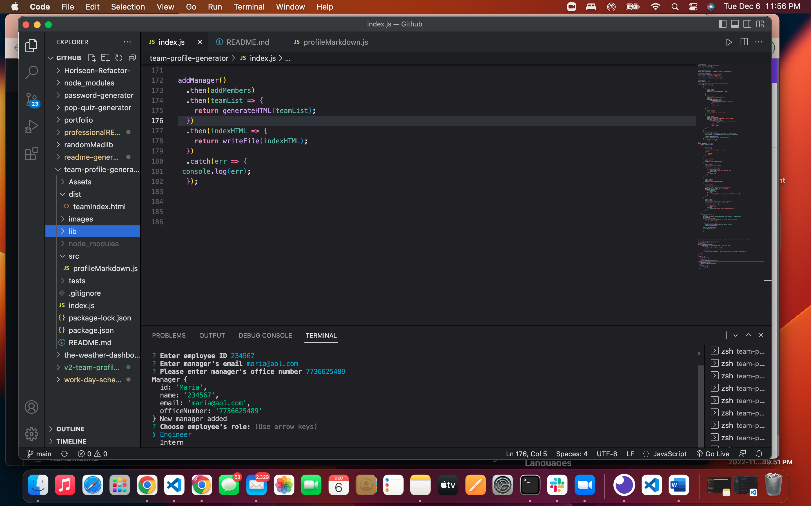

# <team-profile-generator>

## Description
- What was your motivation?
The motivation for this project was to attempt to create what was asked from the prompt and use node with OOP to do so.
- Why did you build this project? 
This project was built to test our understanding of how the back end of a system works. Using node to run the application and trying to debug what went wrong, finding errors within the code .
- What problem does it solve?
This solves the back end portion of understanding the information that can be maniuplated into a server, although this project only touched on that, it was still particularly hard to build and make work.
- What did you learn?
I learned that consoling errors is crucial since we can't tell through breakpoints at what point our code is not executing correctly.

## Installation

use node through terminal

## Usage

GITHUB REPO: https://github.com/flgaitan/team-profile-generator

VIDEO LINK : 
PART 1: https://drive.google.com/file/d/1mO3-JONQAiSSykelvr3anafK7H9U-4pB/view

PART 2: https://drive.google.com/file/d/1yYvVJABDC9HC_lXkvJPX_HH09adf4QYJ/view

Provide instructions and examples for use. Include screenshots as needed.

To add a screenshot, create an `assets/images` folder in your repository and upload your screenshot to it. Then, using the relative file path, add it to your README using the following syntax:

## Credits

- tutoring 

youtube

## License

ISC
---

## Tests

VIDEO LINKS :

https://drive.google.com/file/d/1mO3-JONQAiSSykelvr3anafK7H9U-4pB/view

https://drive.google.com/file/d/1yYvVJABDC9HC_lXkvJPX_HH09adf4QYJ/view
